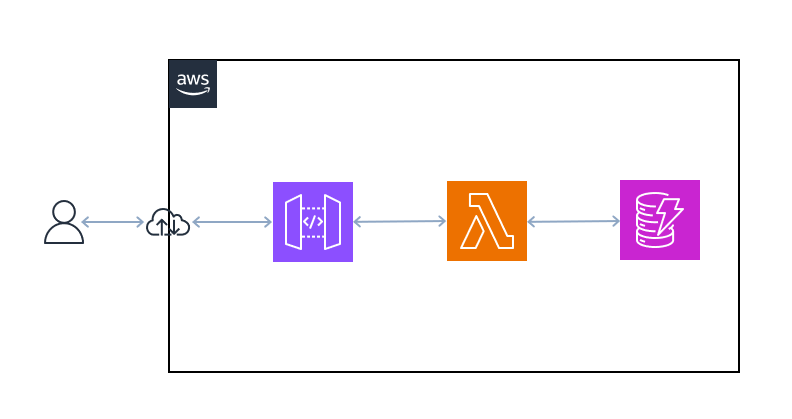

# ポートフォリオの企画

## ゴール
awsリソース, python, flask:　これらを組み合わせて、下記の要件が満たせることを検証する。

### 機能要件

- Publicに公開できるAPIエンドを構築する。
- APIエンドポイントにCURD操作ができるメソッドを用意する。

### 詳細な要件
- プラットフォームはAWS Serverless環境とする。VPCは不要
- デプロイは、`sam_cli`を使う。
- 独自ドメイン名を利用する。`api.ysklab.work`
- Lambdaは **LWD(LambdaWebAdapter)** を利用し作成したコンテナを利用する。後にECSでもコード変更不要で利用できるようにする。**本企画の挑戦的な試み**

## 今回やらないこと
- 詳細なログ出し、ログ保存などの運用面に関する実装
- 実装したメソッドへのunittest
- セキュリティに関する詳細な実装
    - APIGatewayへのWAF適用
    - Lambdaに割り当てるIAMポリシーの最小権限の設定

## 企画のモチベーション
flaskのFormを使ったwebアプリのサンプルコードや書籍は多いが、純粋にRestAPIを作り何かしらのデータストアとCRUD操作を実現するコード例は少ない。実務では、endpointの数によらずデータストアと連携するRestAPIを実装するケースがあるため、その事例に対応できるように自らAPIを自作してみることとした。


## 強く参考又は借用したコード
* `Movies`classと、その内部で使われているboto3を使ったscriptはほぼすべてawsが提供するsdkのサンプルコードを利用
* リンク先:[dynamodb code examples](https://github.com/awsdocs/aws-doc-sdk-examples/tree/main/python/example_code/dynamodb)

# 構成図



- APIGatewayとlambdaはSAM_CLIでデプロイ。
- dynamodbテーブルは事前に手動で作成
    - capacityはプロビジョニングで、readもwriteもCapacityUnit=1

# データモデルとサンプルデータ

## dynamodbテーブルに挿入するデータ

```json
# Example data structure for a movie record in this table:
{
    "year": 1999,
    "title": "For Love of the Game",
    "info": {
        "directors": ["Sam Raimi"],
        "release_date": "1999-09-15T00:00:00Z",
        "rating": 6.3,
        "plot": "A washed up pitcher flashes through his career.",
        "rank": 4987,
        "running_time_secs": 8220,
        "actors": [
            "Kevin Costner",
            "Kelly Preston",
            "John C. Reilly"
        ]
    }
}
```

## テーブル定義

| key         | name  | type            | 
| ----------- | ----- | --------------- | 
| Primary key | year  | Number(integer) | 
| Sort key    | title | String          | 

info属性には、dict型でデータを入れれます。

## dynamodbテーブル名
テーブル名は`test_getstart`とする。

# 実装するendpoint、メソッド、対応付ける関数名
| Endpoint    | method   | 対応する関数   | 
| ----- | ----- | ----- | 
| api.ysklab.work/movies   | GET   | item_get() | 
| api.ysklab.work/movies/add   | POST   | item_add() | 
| api.ysklab.work/movies/delete  | POST   | item_delete() | 
| api.ysklab.work/movies/exists  | GET   | movie_exists() | 


# 操作方法

## 実装するメソッド
- movie_is_exists
- item_add
- item_get
- item_delete

## movie_is_exists()

| 引数   | type                      | どこから取得するか | 
| ------ | ------------------------- | ------------------ | 
| movies | Movieクラスのインスタンス | グローバル変数     | 
| table_name | String | グローバル変数 |


| 戻り値           | type    | 
| ---------------- | ------- | 
| Code             | integer | 
| is_movies_exists | bool | 

```bash
curl -X GET https://target.domain.com/movies/exists
```

## item_add()

| 引数   | type                      | どこから取得するか   | 
| ------ | ------------------------- | -------------------- | 
| movies | Movieクラスのインスタンス | グローバル変数       | 
| title  | String                    | POSTリクエストボディ | 
| year   | Number                    | POSTリクエストボディ | 
| plot   | String                    | POSTリクエストボディ | 
| rating | float                     | POSTリクエストボディ |

| 戻り値 | type    | 
| ------ | ------- | 
| Code   | integer | 
| status | string  | 

```bash
curl -X POST https://target.domain.com/movies/add \
     -data '{"title": "Matrix", "year": 2000, "plot": "good", "rating": 9.8}' 
```

## item_get()

| 引数   | type                      | どこから取得するか          | 
| ------ | ------------------------- | --------------------------- | 
| movies | Movieクラスのインスタンス | グローバル変数              | 
| title  | String                    | GETリクエストパラメータ引数 | 
| year   | Number                    | GETリクエストパラメータ引数 | 

| 戻り値 | type    | 
| ------ | ------- | 
| Code   | integer | 
| status | Itemオブジェクト  | 

```bash
curl -X GET https://target.domain.com/movies \
     -data '{"title": "Matrix", "year": 2000}' 
```

## item_delete()

| 引数   | type                      | どこから取得するか   | 
| ------ | ------------------------- | -------------------- | 
| movies | Movieクラスのインスタンス | グローバル変数       | 
| title  | String                    | POSTリクエストボディ | 
| year   | Number                    | POSTリクエストボディ | 

| 戻り値 | type    | 
| ------ | ------- | 
| Code   | integer | 
| status | string  | 

```bash
curl -X POST https://target.domain.com/movies/delete \
     -data '{"title": "Matrix", "year": 2000}' 
```

# テスト

コードを書いてunittestは実施しないが、デプロイ後にPostmanでapiテストは実施

# 参考資料
* [dynamodb code examples](https://github.com/awsdocs/aws-doc-sdk-examples/tree/main/python/example_code/dynamodb)
* [SAM_CLI公式ドキュメント](https://github.com/aws/aws-sam-cli)
* [boto3公式ドキュメント](https://boto3.amazonaws.com/v1/documentation/api/latest/index.html)
* [flask公式ドキュメント_英語](https://flask.palletsprojects.com/en/stable/)
* [LWD公式リポジトリ](https://github.com/awslabs/aws-lambda-web-adapter)
* [LWD解説記事](https://aws.amazon.com/jp/builders-flash/202301/lambda-web-adapter/)

# 今後の展望
- もっと複雑なデータ構造(sort-keyを作り方を工夫)のItemsを扱えるようにする
- CRUD操作時の例外処理が足りていない。少し間違うと`500`エラーとなるため、間違いの理由を説明し再トライを促す処理が必要
- CI/CD(GithubActionsを想定)で、各種自動化を導入する
    - テスト自動化、静的解析とチェック自動化、型チェック自動化
    - コンテナの脆弱性のチェック自動化(trivyやdockleの導入)
    - dependabotsのよりライブラリの更新チェック自動化
- 詳細なログ出しとログ保存をして、開発時のデバグ速度向上。運用後のトラブルシュートの容易性向上
- unittestを用いてローカル環境でできるテストを充実させる。